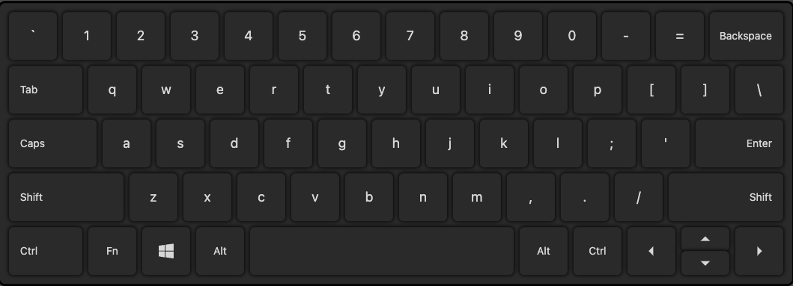
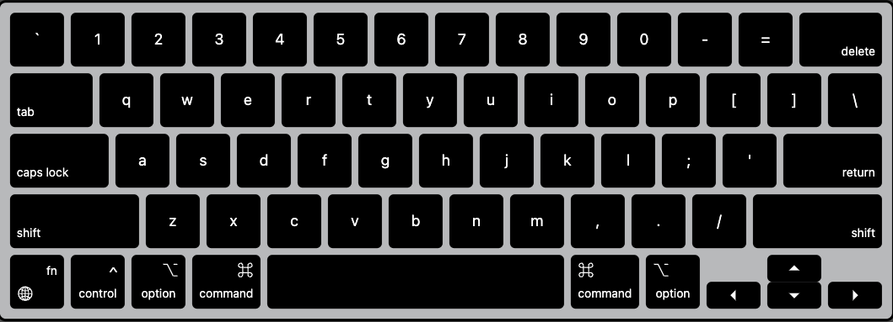
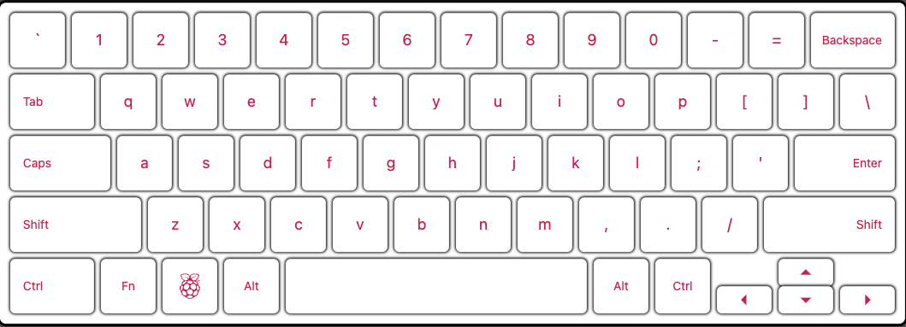

## Virtual Keyboard

This project servers three purposes. First, to compare the special keys on different keyboards. Second, to provide a virtual keyboard on screen. Third, to provide an online model for designing, buying keyboards.

I have stayed reasonably faithful to the original, but have taken artistic liberty to make the keyboard more pleasing to eyes on the web and better contrast the difference between each keyboards.

## System Design

### KeyCap

Since shifting and cap lock are binary conditions, we can make a simple truth table:

| shifting | cap lock | output |
|----------|----------|--------|
| 0        | 0        | a      |
| 1        | 0        | A      |
| 0        | 1        | A      |
| 1        | 1        | a      |

This is (negation of) exclusive or, so we can use ^ in code. (JS, TS does not support ^ between boolean, use !== instead)

While this is quite a trivial state machine, knowing that there are around 50 keys on a keyboard, every slight improvement in code design or efficiency is a big gain.

### Keyboard

For the keyboards, there are many ways to implement it. You can hard-code all the different layout for every single one but that is not scalable. And about two third of the keys will be the same so it is not following the DRY principle either. We can also make a class and use OOP. But after some consideration, all I need is some fallback, strictly speaking I do not need any method. My attention was thus brought to a lesser known feature in Javascript: Prototype.

## Preview

These are actual screenshots of the virtual keyboards.

## Copyright, Legal

The developer is not affiliated with the following companies.

Windows™ is a rightful property of Microsoft.

Mac™ is a rightful property of Apple.

Linux™ is a rightful property of Linux Foundation.

Raspberry Pi™ is a rightful property of Raspberry Pi Foundation.

I want to make it clear that since I don't own everything in this project, if you want to use this for commercial or closed source purposes, you need approval from the respective owner. The developer will not be held responsible for neglection on observing the copyright status of this project.

## Changelog