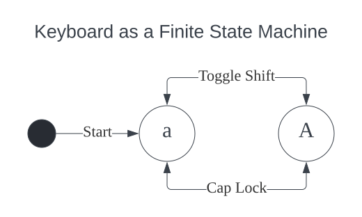

## Virtual Keyboard

This project servers three purposes. First, to compare the special keys on different keyboards. Second, to provide a virtual keyboard on screen. Third, to provide an online model for designing, buying keyboards.
<!-- The virtual keyboards are almost 1:1 true scale. -->

## System Design

Since shifting and cap lock are binary conditions, we can make a simple truth table:
| shifting | cap lock | output |
|----------|----------|--------|
| 0        | 0        | a      |
| 1        | 0        | A      |
| 0        | 1        | A      |
| 1        | 1        | a      |

This is exclusive or, so we can use ^ in code.

While this is quite a trivial state machine, knowing that there are around 50 keys on a keyboard, every slight improvement in code design or efficiency is a big gain.

## Changelog