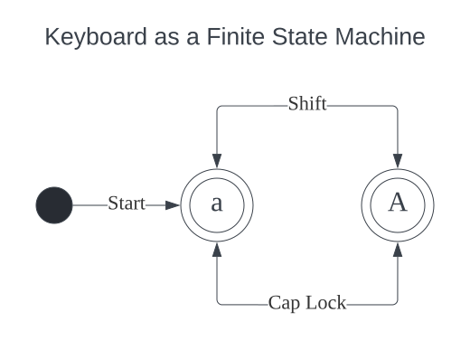

## Virtual Keyboard

This project servers three purposes. First, to compare the special keys on different keyboards. Second, to provide a virtual keyboard on screen. Third, to provide an online model for designing, buying keyboards.
<!-- The virtual keyboards are almost 1:1 true scale. -->

## System Design

While this is quite a trivial state machine, knowing that there are around 50 keys on a keyboard, every slight improvement is a big gain.

## Changelog